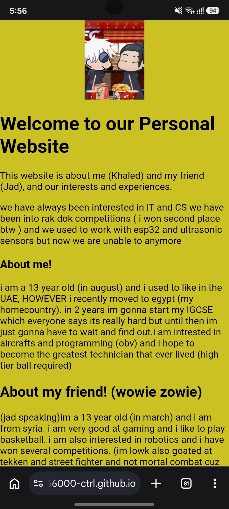

# Personal Website
This is our personal website which tells you guys information about me and my 2 other friends. 

Check out the Website! (https://maali666000-ctrl.github.io/personal-website/)

This websites features are:
- It has a fade in animation
- We changed the font rather than using the default html
- we also changed the background color
- (we are gonna add more interactive features soon)
-If you wanna run the website locally here are the steps:
1. click on code on the top right and download the zip.
2. extract the zip folder and open the folder on vscode
3. make sure you have the live server extention installed and click on start live server on the bottom
4. 
boom. that easy.
